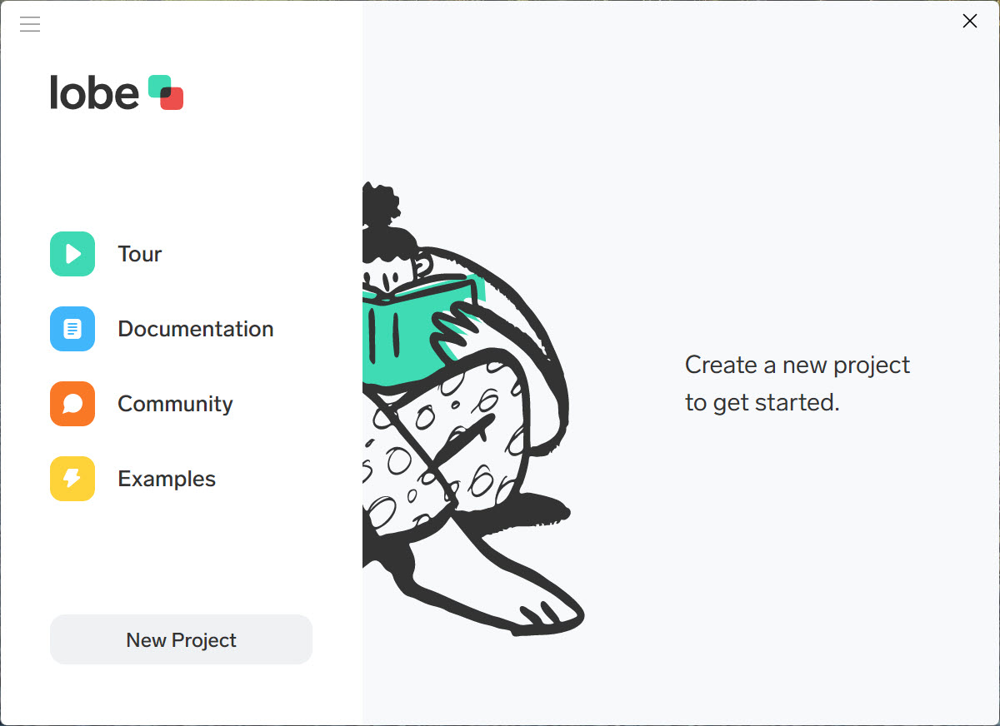
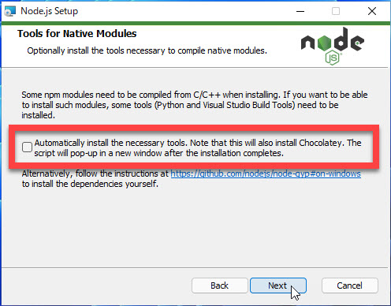
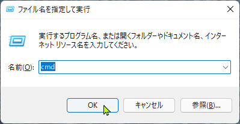
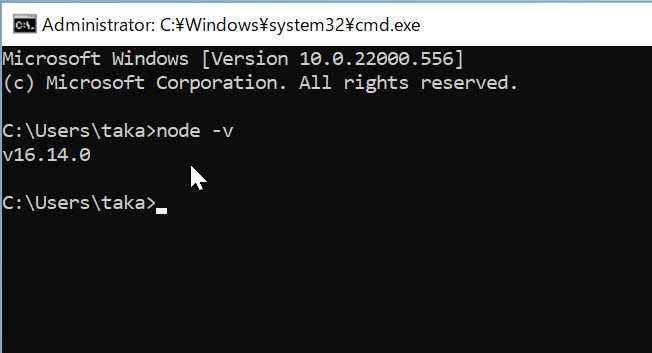
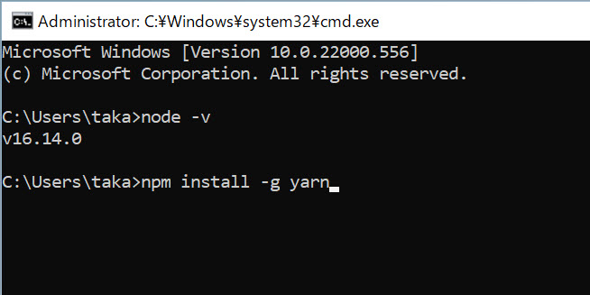
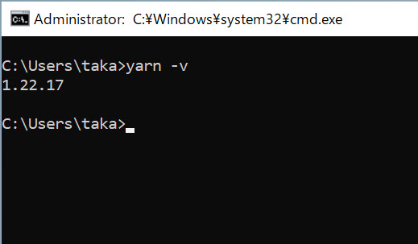

# 環境構築

画像分類アプリ作成の体験の最初に環境を構築します。

> 体験授業ではすでに環境構築が完了しているかもしれません。  
> 講師やスタッフの指示に従ってください。

<br />

この体験授業では、[**Lobe**](https://www.lobe.ai/) という無償のツールを使用して画像分類モデルを作成します。  
LobeはWindows専用のアプリケーションなので、他のOSでは使用できません。

環境構築は以下の手順で進めます。

- [環境構築](#環境構築)
  - [Lobeのダウンロード、インストール](#lobeのダウンロードインストール)
  - [Node.js, yarn のダウンロード、インストール](#nodejs-yarn-のダウンロードインストール)

<br />

---

## Lobeのダウンロード、インストール

[**Lobe**](https://www.lobe.ai/) は簡単に画像分類モデルを作成できるツールです。  
Windows専用のアプリケーションで無償で利用できます。

<br />

1. [Lobe](https://www.lobe.ai/) のホームページをWebブラウザーで開き、[Download] ボタンでインストーラーをダウンロードします。  
   [Download] ボタンは2個あり、どちらを使ってもかまいません。 

   

<br />

2. インストーラーがダウンロードできたらインストールします。  
   インストール先は変更しないで進めます。  

   

<br />

3. インストーラーの最後で [Run Lobe] をチェックしたままで [Finish] します。  

   > [Run Lobe] のチェックを外して [Finish] した場合はWindowsのスタートボタンからLobeを起動してみます。

   

<br />

4. Lobeの初回起動時にファイアウォールの設定ダイアログが開いた場合は、プライベートネットワーク、パブリックネットワークともチェックして [アクセスを許可する] でファイアウォールの設定を行います。

   

<br />

5. Lobeの初回起動時はさらにLobe自体の確認画面が3枚表示されます。  
   すべてデフォルトのボタンをクリックして先に進めます。

   
   
   

<br />

6. Lobeが起動すればインストール成功です。  
   ここでLobeは終了してかまいません。
   
   > Lobeが起動すると以下のどちらかの画面が表示されるはずです。

   <br />

   
   

<br />

---

## Node.js, yarn のダウンロード、インストール

[**Node.js**](https://nodejs.org/ja/) はJavaScript実行環境です。  
Webアプリケーションで広く使われています。

この体験授業では画像分類アプリの実行環境としてNode.jsを使用します。  
また実行に必要なパッケージ（アプリで使用するファイルなど）の管理にはyannを使用します。

> 体験授業の範囲ではプログラミング経験は不要です。  
> 実行環境やパッケージ管理についても教材の範囲では詳しく扱いません。

<br />

1. [Node.js](https://nodejs.org/ja/) のホームページをWebブラウザーで開き、[**16.14.0 LTS**] をダウンロードします。  

   

<br />

2. インストーラーがダウンロードできたらインストールします。  
   インストーラーはほとんどデフォルトのままで進めますが、途中の [Tools for Native Module] の [Automatically install the nescessary tools.] は今回は不要なのでチェックを外して次に進みます。

   > チェックを入れて次に進んでもこの後の体験学習には支障はありませんがインストール完了まで時間がかかります。

   

<br />

3. Node.jsのインストールが完了したら、Windowsのコマンドプロンプトを開きます。  

   > コマンドプロンプトの開き方がわからない場合は、Win + R (Windowsキーを押しながら "r" を押す) で [ファイル名を指定して実行] を開き、"**cmd**" と入力します。  
   >
   >   

<br />

4. コマンドプロンプトで以下を入力して、Node.jsが正しくインストールされていることを確認します。  

   ```cmd
   node -v
   ```

   バージョン番号が表示されればインストールできています。  
   このまま操作するので、コマンドプロンプトは開いたままにします。

   

<br />

5. yarnをインストールします。  
   コマンドプロンプトで以下を入力します。

   ```cmd
   npm install -g yarn
   ```
   
   

<br />

6. 念のため yarnのバージョンを確認します。  

   ```cmd
   yarn -v
   ```

   

<br />

---

以上で演習を実行するための開発環境ができました。

続いてLobeを使って画像分類モデルを作成します。  
PCにWebカメラが接続されているかどうかで以下のどちらかで演習します。

- Webカメラが接続されている場合・・・ [02_lobe_a.md](./02_lobe_a.md)
- Webカメラが接続されていない場合・・・[02_lobe_b.md](./02_lobe_b.md)