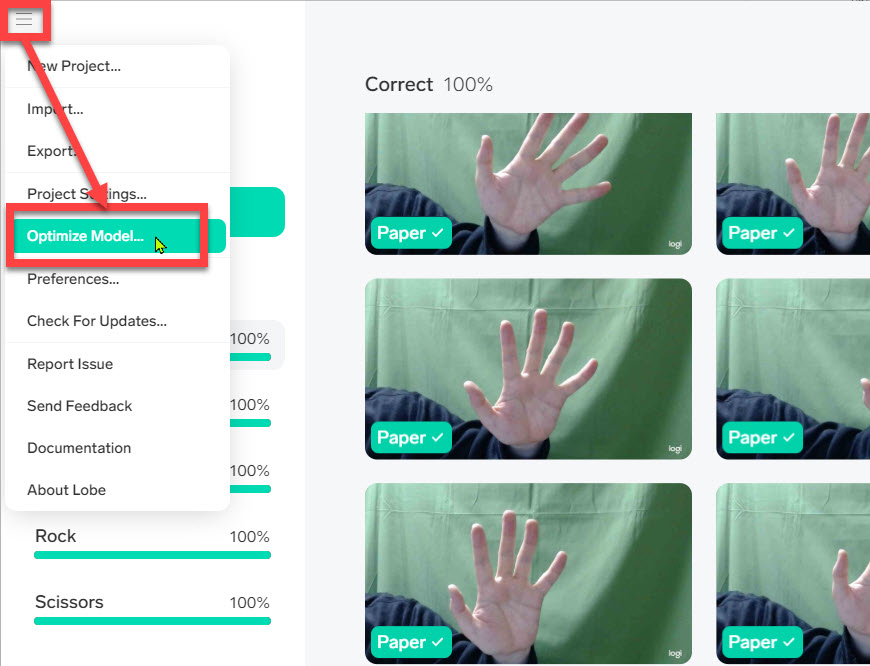

# Lobeで画像分類モデルを作成 (Webカメラを使用)

> このパートは **Webカメラが接続されたPC** で画像分類モデルを作成する演習です。  
> Webカメラが接続されていないPCを使用する場合は [Lobeで画像分類モデルを作成 (事前に用意した画像ファイルを使用)](./02_lobe_b.md) の手順で演習します。
>
> Webカメラが接続されたPCでも周囲の環境（部屋の明るさなどで適切な画像が撮影できない場合など）によっては **事前に用意した画像ファイルを使用する** パートが適することもあります。

 

[**Lobe**](https://www.lobe.ai/) は **画像分類モデル** を簡単に作成できるツールです。  
提供されているのはWindows版のみですが、無償で利用できて作成したモデルに対しても費用はかかりません。  
モデルを作成するためにAIや機械学習、深層学習の知識は不要で、簡単にAI開発ができます。

Webカメラで撮影した画像をその場で学習する機能を持っているので、ここでは **じゃんけんの手の形** を分類するモデルを作成します。  
作成したモデルは次のステップで実際にアプリケーションに組み込んで利用します。

 

---

## 新規プロジェクトの作成

新規プロジェクトを作成して学習の準備をします。

1. Lobeを起動します。
2. 以下の画面が表示されたら [**New Project**] をクリックします。  

   > 下の画面が表示されない場合はこの手順はスキップします。

    

   

 

3. プロジェクト画面が表示されたら、**プロジェクト名を変更** します。  
   左上にある "**Untitled**" がデフォルトのプロジェクト名なので、この部分をクリックします。  
   例えば "**Rps**" (=Rock-Paper-Scissors: じゃんけん) に変更します。

   > プロジェクト名は何でもいいので "Janken" や "GuChokiPa" など他の名前にしてもかまいません。  
   > ただしアルファベット (先頭以外は数字でもよい) を使うのがよいと思います。

    
   
   

 

---

## 画像の取り込み

学習させる画像を取り込みます。  
LobeではWebカメラの画像を連続して取り込んですぐに学習させる機能があります。

1. 右上にある [**Import**] をクリックします。  
   さらに [**Camera**] をクリックします。

   

 

2. PCにカメラが複数個接続されている場合は、どのカメラを使用するかを選択します。  
   カメラの画像が表示される領域の右上にある **歯車** をクリックして使用するカメラを選択します。  
   
   

 

3. 取り込み領域の左下に "**Rock**" と入力します。  
   Webカメラに向けて、じゃんけんのグーを写した状態で、中央下の丸い部分をしばらく押したままにします。  
   画像が連写されるので、ゆっくり手の位置や角度などを変えていきます。

   画像は30枚程度以上、できれば 50枚以上保存するようにしてください。  
   途中で止めて改めて続きを連写することも可能です。

   > "Rock" の代わりに "Gu" などのラベルしてもかまいません。

   > 連写中に手を速く動かすと画像がブレて学習に適さないことがあります。  
   > ブレないようにゆっくり動かします。

   

 

4. 同じ要領で、ラベルを "Paper" にして、じゃんけんのパーを連写します。  
   さらにラベルを "Scissoros" にして、じゃんけんのチョキを連写します。  

   > ラベルは "Paper" の代わりに "Pa"、"Scissoros" の代わりに "Choki" などにしてもかまいません。

   それぞれの画像の枚数は多少違っていてもかまいません。  
   それぞれ **50枚程度以上** を目安に画像を保存します。

 

---

## 自動的な学習と学習品質の確認

ラベルを付けて画像を保存すると、すぐに自動で学習が始まります。

学習中および学習が終わった後で、学習の品質を確認します。

1. Lobeのメニューで [Train] をクリックします。  
   その時点での学習結果がわかります。

   

    

   この図では100%の品質で学習できました。  
   一般にはもっと低いスコアが出ることがあります。

 

2. より適切な方法で学習してスコアを上げてみます。  
   左上のメニューを開いて [**Optimize Model**] を選択します。  

   

 

3. ポップアップが開いたら [**Optimize**] をクリックします。  
   少し時間がかかりますが、これで学習モデルの最適化（よりスコアが高いモデルの作成）できます。  

     

    

   一般にスコアが100%になるとは限りません。  
   例えば人間でも区別が難しい画像の場合は、AIにも区別は難しいはずです。  
   また学習したデータが不十分であるために十分なスコアが得られないこともあります。    
   
   多少低いスコアであっても、目的によっては利用可能であり十分役に立つことが多くあります。  
   実際の利用では、あるスコアが実用的かどうかを判断して、役に立つようであればそのモデルを利用します。  
   どのくらいのスコアが実用的かは、利用したい内容や目的によるので、一概にどのくらいのスコアがいいかを決めることはできません。

   今回は手順を理解することを目的としているので、上記の通りモデルの最適化を実行します。