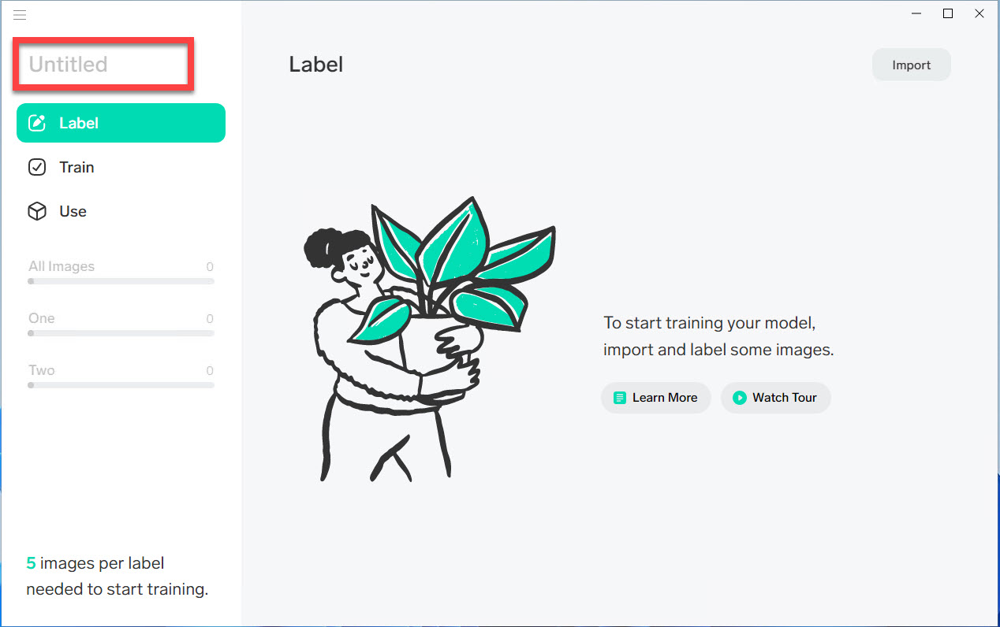
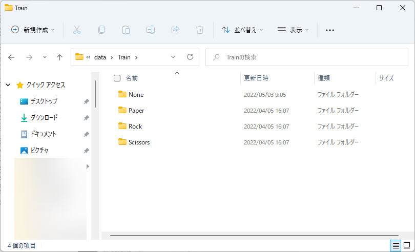
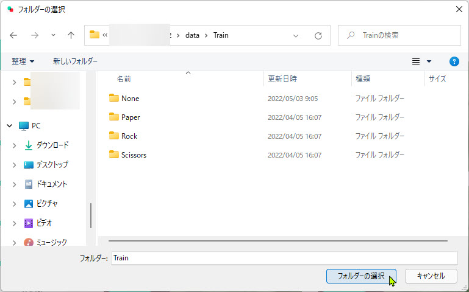
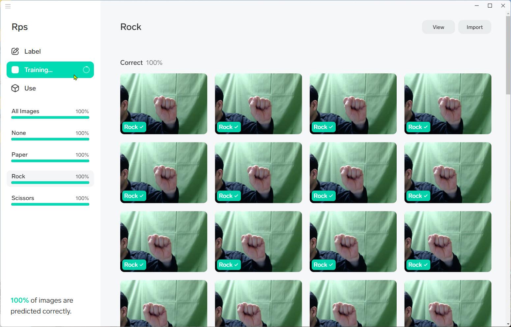

# Lobeで画像分類モデルを作成 (事前に用意した画像ファイルを使用)

> このパートは **Webカメラが接続されていないPC** で画像分類モデルを作成する演習です。  
> Webカメラが接続されていないPCを使用する場合は [**Lobeで画像分類モデルを作成 (Lobeで画像分類モデルを作成 (Webカメラを使用)**](./02_lobe_a.md) の手順で演習します。  
>
> ただしWebカメラが接続されたPCでこちらのパートも演習することは可能です。  

 

[**Lobe**](https://www.lobe.ai/) は **画像分類モデル** を簡単に作成できるツールです。

以下では、**あらかじめ用意した画像ファイル** を学習して画像分類モデルを作成します。  
以下のどちらかの場合には、用意した画像ファイルを使って以下の演習を行います。

- Webカメラが接続されていないPCを使っている場合  
- 周囲の環境などの影響でWebカメラの利用が適さない場合

ここでは **じゃんけんの手の形** を分類するモデルを作成します。  
作成したモデルは次のステップで実際に [アプリケーションに組み込んで](./03_runapp.md) 利用します。

 

---

## 新規プロジェクトの作成

新規プロジェクトを作成して学習の準備をします。

1. Lobeを起動します。
2. 以下の画面が表示されたら [**New Project**] をクリックします。  

   > 下の画面が表示されない場合はこの手順はスキップします。

    

   

 

3. プロジェクト画面が表示されたら、**プロジェクト名を変更** します。  
   左上にある "**Untitled**" がデフォルトのプロジェクト名なので、この部分をクリックします。  
   例えば "**Rps**" (=Rock-Paper-Scissors: じゃんけん) に変更します。

   > プロジェクト名は何でもいいので "Janken" や "GuChokiPa" など他の名前にしてもかまいません。  
   > ただしアルファベット (先頭以外は数字でもよい) を使うのがよいと思います。

    
   
   

 

---

## 画像の取り込み

学習させる画像を取り込みます。  
Lobeには、既存の画像ファイルを取り込んですぐに学習させる機能があります。

1. このコンテンツには "data" フォルダーがあり、この中に演習で使用する画像ファイルがあります。  
   まずこのフォルダーの中を確認してみます。

   "data/Train" フォルダーに学習で使用する画像ファイルがあります。

   

    
   
   

    

   "Paper" フォルダーには "パー" の画像が30枚、"Rock" と "Scissors" にはそれぞれ "グー" と "チョキ" の画像がそれぞれ30枚あります。

   

    

   事前に画像ファイルを用意する場合は、このように "**ラベル名**" のフォルダーを用意して、その中に該当する画像ファイルを保存しておきます。

    
   
   > 学習に使用する画像はもちろん他のものでもよく、例えばインターネット上で画像を集めたり、自分で撮影したりすることも可能です。  
   > その場合は、**ラベルごとに最低30枚** 以上、可能ならそれぞれ50枚以上の画像ファイルを用意します。
   >
   > この演習では画像を集める手間をかけないため、事前に用意したファイルを使用します。  

 

2. 右上にある [**Import**] をクリックします。  
   さらに [**Camera**] をクリックします。

   

 

3. インポートする画像があるフォルダーを選択します。  
   ここでは "**data\Train**" フォルダーを選択します。  

   > "Paper", "Rock", "Scissors" サブフォルダーを含むフォルダーを選択します。

   Lobe では自動的にサブフォルダー名をラベルとして画像ファイルを取り込んでくれます。

   

 

---

## 自動的な学習と学習品質の確認

ラベルを付けて画像を保存すると、すぐに自動で学習が始まります。

学習中および学習が終わった後で、学習の品質を確認します。

1. Lobeのメニューで [Train] をクリックします。  
   その時点での学習結果がわかります。

   

    

   この図では100%の品質で学習できました。  
   一般にはもっと低いスコアが出ると考えてください。

 

2. 学習を最適化してスコアを上げてみます。  
   左上のメニューを開いて [**Optimize Model**] を選択します。  

   

   > 学習の最適化とは、学習のルール（アルゴリズム）を変更してより品質の高いモデルを作成することです。その分、学習に時間がかかります。
   

 

3. ポップアップが開いたら [**Optimize**] をクリックします。  
   少し時間がかかりますが、これで学習モデルを最適化できます。  

   今回は手順を理解することを目的としているので、元のスコアによらずモデルの最適化を実行します。  
   
     

    

   最適化後でもまだ十分なスコアにならないことがあり得ます。  
   このような場合は実際には、データを追加したり、より学習しやすいデータで置き換えたりします。  
   今回は学習後のスコアや最適化後のスコアについてはあまり気にせず、手順を理解することにします。　

    

   > 一般に、スコアが100%になるとは限りません。  
   > 例えば人間でも区別が難しい画像の場合は、AIにも区別は難しいと言えます。  
   > また学習したデータの数が不十分であったりデータの偏りが大きい場合には、十分なスコアが得られないことがあります。    
   >
   > 実際の利用では、多少低いスコアであっても利用可能であり十分役に立つことがあります。  
   > このような場合はスコアが低いことを理解したうえで、目的の用途では利用することはよくあります。
   > どのくらいのスコアが実用的かは、利用したい内容や目的によるので一概にいくら以上ならが利用可能かを言うことはできません。

 

---

以上であらかじめ用意した画像ファイルを利用して画像分類モデルを作成できました。  
続いて、今回作ったモデルを実際に **アプリケーションに組み込んで利用** できるようにします。

なお、このステップでモデルを作った場合は [Webカメラを利用](./02_lobe_a.md) して学習する手順については演習する必要はありません。  