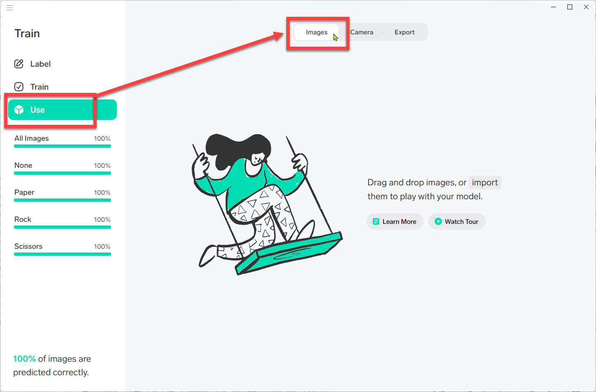
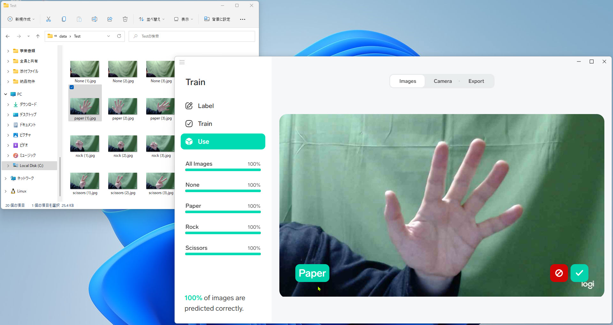

# Lobeで画像分類を実行

前のステップで作成したモデルを使って、実際に画像分類を行ってみます。

まずはLobeの中で画像分類をしてみます。

> このステップで正しく分類できることが確認できれば、[次のステップ](./04_runapp.md) で実際にモデルをアプリケーションに組み込んで実行してみます。

 

---

## 保存済みの画像ファイルをLobeで分類

学習モデルをアプリケーションに取り込む前に、Lobeで分離の動作確認を行ってみます。

前のステップでモデルの品質を数値的に確認してみました。

以下では実際に、事前に用意した保存済みの画像ファイルを正しく分類できるか確認してみます。

> Webカメラで学習した場合は、保存済み画像ファイルを正しく分類できない可能性があります。  
> これは背景に写っているものや部屋の明るさなどが異なるため、分類を間違うためです。  
> 
> 今回は手順を確認することを目的とするので、正しく分類できないケースは無視します。

 

1. インポートする画像があるフォルダーをエクスプローラーで開きます。  
ここでは "**data\Test**" フォルダーを開きます。  

   

    

   > テストには **Train** フォルダーの画像を使わないでください。  
   > Train フォルダー内の画像ファイルは学習で使用したものなので、分類モデルはそれらの画像が何に分類されるかを知っています。  
   > 初めて見る画像を正しく分類できることが AI にとって大事なことです。

 

2. Lobeで [**Use**]-[**Images**] を選択します。  

   

 

3. "Test" フォルダー内の任意の画像ファイルをLobeにドロップします。　　

   

 

4. Lobeにドロップした画像が表示されて、左下に分類したラベルが表示されます。  

   

 

Test フォルダー内の画像が正しく分類できることを確認できました。

 

---

## Webカメラを使用してLobeで分類

Webカメラが接続されたPCを使用している場合は、Webカメラを使用して分類の動作確認を行うこともできます。  
手の形の変化に合わせてすぐに分類ラベルが変わるので、動作確認がより簡単で楽しいと思います。

> Webカメラが接続されていないPCでは以下の演習はできません。

 

1. Lobeで [**Use**]-[**Camera**] を選択します。  
   カメラが複数個接続されたPCでは、画像領域の右上にある **歯車** でテストに使用するカメラを選択します。  

   

2. カメラに手を写します。  
   指の形を変えると、右下に表示される分類ラベルが変更されます。  

Webカメラの画像を分類できることを確認できました。

 

---

Lobeで学習済みの分類モデルで実際に画像分類をしてみました。  
周囲の環境や学習した画像によっては多少間違った分類をすることがありますが、比較的正しく分類が行われることが分かったと思います。

最後のステップでは、作成済みの分類モデルを [アプリケーションに組み込んで](./04_runapp.md) 利用してみます。