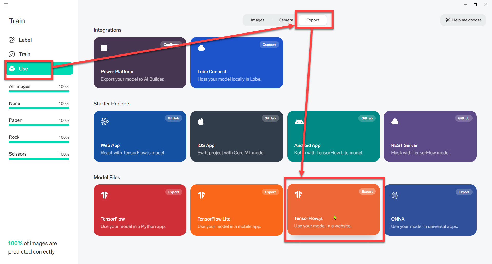

# 画像分類アプリを実行

演習の最後に、Lobeで作成した画像分類モデルを **Webアプリケーション** のテンプレートに取り込んで実際にアプリケーションとして画像分類を行ってみます。

この演習で使用するのは、マイクロソフトにより公開された [**Lobeの学習モデルを簡単に組み込めるアプリケーションテンプレート**](https://github.com/lobe/web-bootstrap) です。

> 演習ではプログラミングの知識や経験は不要です。  
> 
> 使用するアプリケーションテンプレートについての説明も省略しますが、Webアプリケーションのフレームワークとして [**React**](https://reactjs.org/) を使用しています。  
> またプログラミング言語は [**TypeScript**](https://www.typescriptlang.org/) で記述されています。

<br />

---

## 作成済みの分類モデルをエクスポート

Lobeで作成済みの分類モデルをエクスポートします。

1. Lobeで [**Use**]-[**Export**] を選択します。

2. [**TensorFlow.js**] を選択して、分類モデルを出力します。  
   PC上の任意のフォルダーに保存します。（例: デスクトップ）

   

<br />

3. エクスポートが完了したら [**Done**] をクリックしてポップアップを閉じます。  

   

<br />

4. エクスポートしたファイルを確認します。  

   

<br />

---

## アプリケーションテンプレートのダウンロード

公開されているアプリケーションのテンプレートをダウンロードします。

1. Lobeで [**Use**]-[**Web App**] を選択して、さらに [**Web App**] を選択します。  

   

<br />

2. 自動的に [lobe/web-bootstrap](https://github.com/lobe/web-bootstrap) がWebブラウザーで開かれます。

3. [**Code**]-[**Download ZIP**] でテンプレートのソースコードをダウンロードします。  
   ダウンロードは任意のフォルダーに行ってかまいません。（例: デスクトップ）

   

<br />

4. ダウンロードしたZIPファイルで **右クリック** して [**すべて展開**] を選択します。  
   ZIPファイルが展開されます。  

   

<br />

---

## 分類モデルファイルをアプリケーションテンプレートにコピー

Lobeからエクスポートした分類モデルファイルを、PCに展開したアプリケーションテンプレートにコピーします。

1. Lobeからエクスポートした分類モデルのフォルダーを開きます。
2. ダウンロードして展開したアプリケーションテンプレートを開きます。
3. 以下の6個のファイルを分類モデルフォルダーからアプリケーションテンプレートにコピー（または移動）します。  
   コピーする先はアプリケーションテンプレートの "**public/model**" フォルダーです。

   - group1-shard1of4.bin
   - group1-shard1of4.bin
   - group1-shard1of4.bin
   - group1-shard1of4.bin
   - model.json
   - sigunature.json

   <br />

   

---

## アプリケーションの実行

アプリケーションを実行します。

1. エクスプローラーで、アプリケーションテンプレートのルートフォルダーに移動します。  

   > このコンテンツの通りに演習しているのであれば、アプリケーションテンプレートの "public/model" フォルダーにいるはずです。  
   > 二つ上の階層に移動します。

<br />

2. Windowsのコマンドプロンプトを開きます。  

   > コマンドプロンプトがわからなければ、**Windows + R** で[**ファイルを検索して実行**] を開き "**cmd**" と入力して [OK] します。  
   >
   > 

<br />

3. コマンドプロンプトに "**cd **" (最後に半角スペースが必要) と入力します。
4. エクスプローラーのフォルダーアイコンをコマンドプロンプトにドロップします。  
   続いてEnterキーを押します。

   

<br />

5. コマンドプロンプトに以下を入力します。  
   実行に必要なパッケージ（ファイル）が自動的にダウンロードされるので終わるまで少し待ちます。

   ```cmd
   yarn install
   ```

   

<br />

6. コマンドプロンプトに以下を入力します。  

   ```cmd
   yarn start
   ```

   

<br />

7. アプリケーションが起動してWebブラウザーが自動的に開きます。
8. Webカメラの画像、または既存の画像ファイルを使って、アプリケーションで画像を分類します。  
   
   - Webカメラの画像を分類したい場合は、**左上にある歯車アイコン** をクリックして使用するカメラを選択します。  
   - 既存の画像ファイルを分類したい場合は、**右上にある画像アイコン** をクリックします。

   <br />

   

<br />

9. アプリケーションで画像の分類が行われ、左下に分類したラベルが表示されます。

   

<br />

---

以上で、**Lobeを使って画像分類アプリを作成する** 演習は終わりです。

Lobeを使うとAIやプログラミングの知識がなくても簡単に画像分類アプリが作れることが分かったと思います。

実際のビジネスではより良い品質のモデルを作るために高度な知識が必要になることがありますが、アプリ完成までの大きな流れは今回の演習と大きくは違いません。  
この演習を通して、AI開発の基本を理解してもらえたようなら幸いです。